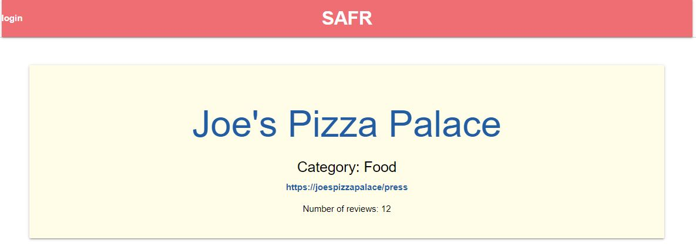
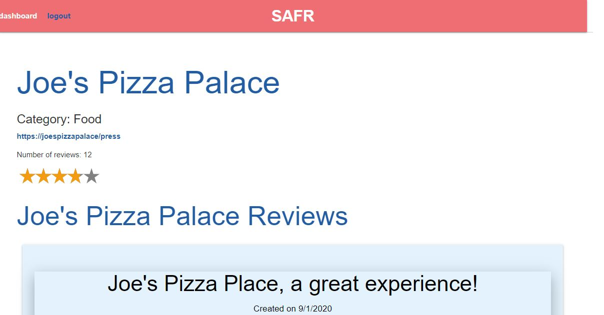

# SAFR

## Purpose
To provide the user with a CMS-style blog site where they can publish posts, reviews, and safety measures offered by various businesses during COVID-19. SAFR is an easy to use mobile friendly website that allows the users to get up-to-date information regarding dining, entertainment, and the outdoors in a location of their choosing. During times of social distancing, it is important for people to take advantage of things that still remain open; however, as many business are currently shuttered/ struggling, they are not routinely updating their information such as hours and new safety standards. SAFR provides the user with a one stop shop for everything they need to know to prepare for their next outing.

## Features
When the user is not logged into the blog, they can see all of the interesting posts that other users have created. When the user creates a new user with their username, email, and password, they can then login to access more content. When logged in, the user can create new posts and edit them, as well as comment on the posts of other users. Each post creation requests a business name, post title, content, and safety measures. For whatever reason a post is no longer relevant, the user can easily delete their work with the click of a button.

## Built With
* JavaScript
* Node JS 
* Express
* MySQL
* Sequelize
* Dotenv

## API testing
Postman

## Usage
To run program: node server

## Website
ADD HEROKU WEBSITE HERE

## Project Status
The CMS-style blog site is compliant with defined acceptance criteria

## Contribution
Created by Neil Dino, Jennifer Mulder, and Marlon Guandique

